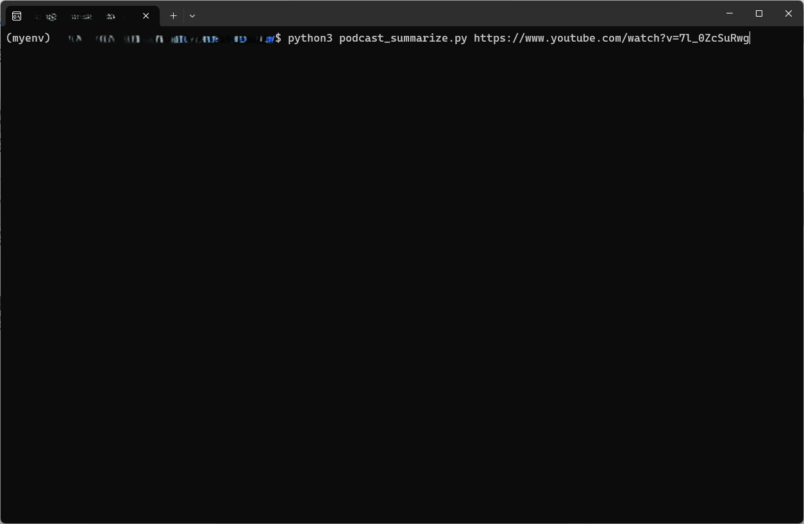

# Podcast Summarizer



Welcome to my **Podcast Summarizer** repository! I'm an avid podcast listener, and I love tuning in while I jog or relax at home. My absolute favorite podcast is *The Diary of A CEO* — check it out [here](https://www.youtube.com/@TheDiaryOfACEO).

Ever listened to a podcast, got inspired by the insights shared, but then realized you can't remember anything afterward? I’ve found myself constantly replaying parts of the episode to take notes. That’s where this personal project comes in! It's designed to help you recall the key points from any podcast without the need to replay the entire episode.

Generative AI

### Environment
I’ve built this using **WSL** (Windows Subsystem for Linux), so make sure you're set up accordingly.

### Install Requirements

To run the podcast summarizer, install the following dependencies:

```bash
pip install youtube-transcript-api yt-dlp openai-whisper google-genai
sudo apt install ffmpeg
```

### Reminder
You’ll need to obtain your **Gemini API key** [here](https://ai.google.dev/gemini-api/docs/api-key).
Then, run the following first before running the script:
```bash
export GEMINI_API_KEY="your_actual_api_key"
```

### Running the Code

Once everything is set up, you can run the summarizer with the following command:

```bash
python3 podcast_summarizer.py [youtube_link]
```

Example:
```bash
python3 podcast_summarizer.py https://www.youtube.com/watch?v=ffgpqk5hZBE
```
Note: it should be the link where you click the video link on YouTube, not the sharing link.

### What Happens in the Background?

1. **Transcript Retrieval**: The script attempts to fetch the transcript from the YouTube video using the `YouTubeTranscriptApi`.
2. **Audio Download**: If the transcript is unavailable, it downloads the audio using `yt-dlp`.
3. **Audio Conversion**: The audio file (in `.mp3` format) is converted to 16kHz mono using **FFmpeg** for optimal transcription.
4. **Transcription**: The audio is then transcribed locally using **Whisper Tiny**.
5. **Summarization**: The transcript is passed to **Gemini 2.0 Flash**, which summarizes the content into key topics and points (especially useful for long podcasts, thanks to the large context window).
6. **File Output**: The transcript and summary are saved locally as `transcript.txt` and `summary.txt`.

### Performance

- The **summarization process is fast** when the transcript can be directly retrieved from YouTube.
- However, if the script **has to download the audio, convert it to WAV, and use Whisper Tiny**, the process is significantly slower.
- On a **low-spec computer (i5 CPU, 8GB RAM)**, Whisper Tiny sometimes **gets killed due to insufficient RAM** when processing long audio files.
- Using the **correct full YouTube video URL (instead of the sharing link)** can improve performance by avoiding unnecessary audio processing.
